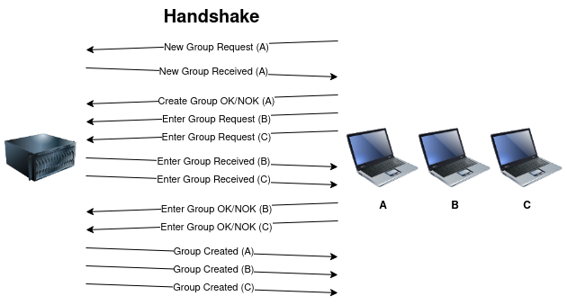

# Protocol
This protocol aims to describe a method to concurrently streaming different movies
to different groups of clients. To do so, it has two mais phases: the 
[handshake](#handshake) phase and the [streaming](#streaming) phase.

In the handshake phase, it establishs a session between the clients in a group
and the server. In the streaming phase, it streams the chosen movie to the
clients in that group.

When the movie has finished being streamed, the session between the group and
the server will be closed.

## Handshake


The handshake process can be described as follows:
1. A leader client sends a request to initiate a new group to the server, with
   the groups members, a port to the session and the interval between stream
   messages.
2. The server responds with the port it has chosen to the session, the group ID
   and the movies available. If the port send by the client is free, the server
   will use it, otherwise it will choose another one.
3. If the chosen port by the server is the one the client sent, or if it's
   another one that is free in the client, the client will proceed to the next
   step. Otherwise, it will cancel the handshake and try again. 
4. If the group can be created, the server will way for the other members to
   join. Each member sends to the server a packet with the *group id* it wants
   to enter, a port to the session and the interval between stream messages.
5. The server responds to each client with the port it has chosen to
   communication with each client.
6. Each client responds whether it could bind to the port chosen by the server
   or not. If the client couldn't initiate a session with the server, it will
   send a new request to enter the group.
7. After the server has finished waiting for the members of the group, it will
   send to every connected member of the group, a packet with the members 
   connected and the interval between stream messages.
8. Upon finishing the handshake, the server will initiate the streaming of the
   movie.

The packets sent in each step are:
1. [New group request](#new-group-request)
2. [New group received](#new-group-received)
3. [Create group ok/nok](#create-group-ok/nok)
4. [Enter group request](#enter-group-request)
5. [Enter group received](#enter-group-received)
6. [Enter group ok/nok](#enter-group-ok/nok)
7. [Group created](#group-created)

### Packets
#### From client to server
##### New group request
```
0               1               2               3               4
0 1 2 3 4 5 6 7 8 1 2 3 4 5 6 7 8 1 2 3 4 5 6 7 8 1 2 3 4 5 6 7 8
+-+-+-+-+-+-+-+-+-+-+-+-+-+-+-+-+-+-+-+-+-+-+-+-+-+-+-+-+-+-+-+-+
|  Type (0x01)  |      Port     | Interval (us) |  Members cnt  |
+-+-+-+-+-+-+-+-+-+-+-+-+-+-+-+-+-+-+-+-+-+-+-+-+-+-+-+-+-+-+-+-+
|M. IPv4|  ...  |
+-+-+-+-+-+-+-+-+
```

##### Create group OK/NOK
```
0               1               2  
0 1 2 3 4 5 6 7 8 1 2 3 4 5 6 7 8 1
+-+-+-+-+-+-+-+-+-+-+-+-+-+-+-+-+-+
|  Type (0x02)  |F|    Movie ID   |
+-+-+-+-+-+-+-+-+-+-+-+-+-+-+-+-+-+
```

##### Enter group request
```
0               1               2               3               4 
0 1 2 3 4 5 6 7 8 1 2 3 4 5 6 7 8 1 2 3 4 5 6 7 8 1 2 3 4 5 6 7 8
+-+-+-+-+-+-+-+-+-+-+-+-+-+-+-+-+-+-+-+-+-+-+-+-+-+-+-+-+-+-+-+-+
|  Type (0x04)  |      Port     |    Group ID   | Interval (us) |
+-+-+-+-+-+-+-+-+-+-+-+-+-+-+-+-+-+-+-+-+-+-+-+-+-+-+-+-+-+-+-+-+
```

##### Enter group OK/NOK
```
0               1  
0 1 2 3 4 5 6 7 8 1
+-+-+-+-+-+-+-+-+-+
|   Type (0x08) |F|
+-+-+-+-+-+-+-+-+-+
```

#### From server to client
##### New group received
```
0               1               2               3               4
0 1 2 3 4 5 6 7 8 1 2 3 4 5 6 7 8 1 2 3 4 5 6 7 8 1 2 3 4 5 6 7 8
+-+-+-+-+-+-+-+-+-+-+-+-+-+-+-+-+-+-+-+-+-+-+-+-+-+-+-+-+-+-+-+-+
|  Type (0x10)  |      Port     |    Group ID   |   Movie cnt   |
+-+-+-+-+-+-+-+-+-+-+-+-+-+-+-+-+-+-+-+-+-+-+-+-+-+-+-+-+-+-+-+-+
|    Movie ID   | Mo. name size |   Movie name  |      ...      |
+-+-+-+-+-+-+-+-+-+-+-+-+-+-+-+-+-+-+-+-+-+-+-+-+-+-+-+-+-+-+-+-+
```

##### Enter group received
```
0               1               2
0 1 2 3 4 5 6 7 8 1 2 3 4 5 6 7 8
+-+-+-+-+-+-+-+-+-+-+-+-+-+-+-+-+
|  Type (0x20)  |      Port     |
+-+-+-+-+-+-+-+-+-+-+-+-+-+-+-+-+
```

##### Group Created
```
0               1               2               3               4
0 1 2 3 4 5 6 7 8 1 2 3 4 5 6 7 8 1 2 3 4 5 6 7 8 1 2 3 4 5 6 7 8
+-+-+-+-+-+-+-+-+-+-+-+-+-+-+-+-+-+-+-+-+-+-+-+-+-+-+-+-+-+-+-+-+
|  Type (0x40)  | Interval (us) |  Members cnt  |M. IPv4|  ...  |
+-+-+-+-+-+-+-+-+-+-+-+-+-+-+-+-+-+-+-+-+-+-+-+-+-+-+-+-+-+-+-+-+
```

#### Fields
| Field | Meaning |
|------ | ------- |
| [Type](#type) | Type of packet |
| [Port](#port) | Port that will be used to communicate |
| [Interval](#interval) | Time interval between stream packets |
| [Members cnt](#members) | How many members will join the group |
| [M. IPv4](#members) | IPv4 address of member |
| [Movie ID](#movie) | Indicates the ID of a movie |
| [Group ID](#groups-id) | Indicates the ID of a group |
| [Mo. name size](#movie) | Indicates the length of the movie name in bytes |
| [Movie name](#movie) | Name of the movie |
| [F](#flag) | Flag to indicate whether the client could connect to the server
or not|
| ... | In packets with variable size, the dots represents the remaining elements |

##### Type
Each message has a type to indicate the operation type and each type is a power of
two. The flags and it's values are listed in the table below:

| Type | Packet |
| --- | ------ |
| 0x01 | [New group request](#new-group-request) |
| 0x02 | [Create group ok/nok](#create-group-ok/nok) |
| 0x04 | [Enter group request](#enter-group-request) |
| 0x08 | [Enter group ok/nok](#enter-group-ok/nok) |
| 0x10 | [New group received](#new-group-received) |
| 0x20 | [Enter group received](#enter-group-received) |
| 0x40 | [Group created](#group-created) |

##### Port
During the negotiation phase, the port field is used to determine which port
will be used in communication by both the server and the client. After
succesfully binding to a commom port, the communication between the server and
the client will occur through it. The server will send it's packets throgh the
new port and expect new packets from the client to arrive though the new port. 
The client will close the socket to the standart port.

##### Interval
A interval time in microseconds between stream packets can be set, both the server 
and the clients can set a interval time. During handshake it's value will be 
chosen by taking the biggest value set by the server and the clients in the 
trasmission group.

##### Members
Each group has a set of members that are identified by it's IPv4 addressess.
During handshake the leader member (the one to initiate the handshake process),
will send the amount of members that are expected to join and the IPv4 address
of each member.

##### Movie
Each movie is represented by a ID. During the handshake the movie to be streamed 
is chosen by the leader member.

##### Flag
At the end of the handshake, the flag field indicates whether the client could
bind to the same port as the server or not. A value of 1 indicates that the
connection was succesful, and a value of 0 indicates that the client couldn't
connect.

## Streaming

## Limitations
* The protocol doesn't define any protection against attacks to the server or to 
the client by overloading them with requests/responses.
* It also doesn't ensure that all members could connect to the server before
  starting to stream.
* After a stream has started, no other member can join, neither the stream can be
  paused.
* When connection between server and client is lost, it isn't known until the
  timeout for the socket expires. 
* When a client loses connection to the server, the other clients in the group
  are not notified.
  notified of the connection lost of the client.
* The handshake phase has an overhead in the packets send and in the retries when
  the client can't bind to the same port as the server.
* It works only for IPv4 addresses.

# Implementation
## Server
## Client

To avoid trying to connect indefinitly to the server, the client has a limit to
the number of attempts to try to establish the handshake.

## Sockets
## Log
## Watchdog
