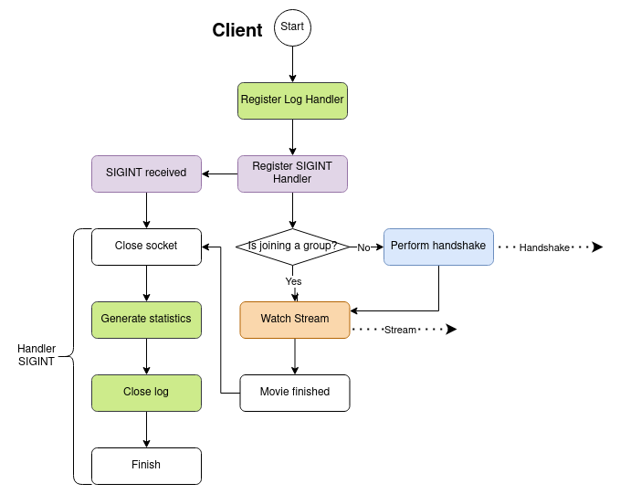
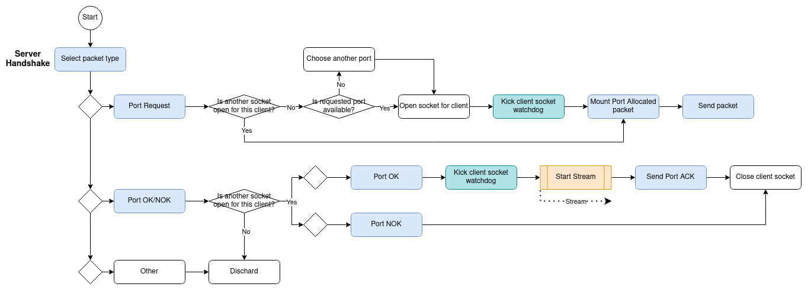
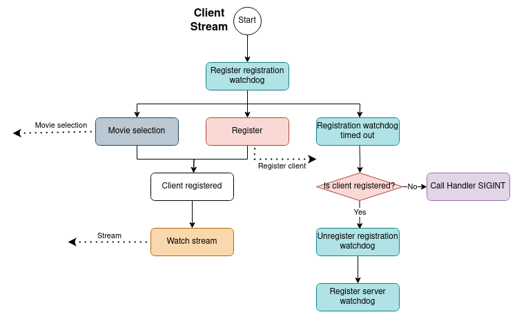
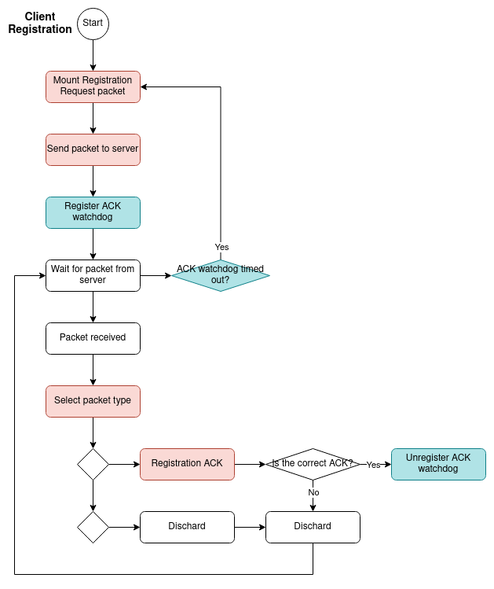

# Protocol
This protocol aims to describe a method to concurrently streaming different Musics
to different groups of clients. To do so, it has two mais phases: the 
[handshake](#handshake) phase and the [streaming](#streaming) phase. In the handshake 
phase, it allocates a port between a leader client and the server. 
In the streaming phase, the clients wishing to join register to that session 
and the leader client chooses a available Music from the server to be streamed.
When the Music has finished being streamed, the session is closed.

## Handshake


The handshake process can be described as follows:
1. A leader client sends a request to a dedicated port of his choice
2. The server tries to allocated the requested port, in case it is being used,
   it allocates another one, and sends which port it has allocated for the
   client.
3. The client answer if it can or cannot use that port,
4. The server acknowledge the client answer.

The packets sent in each step are:
1. [Port Request](#port-request/port-allocated)
2. [Port Allocated](#port-request/port-allocated)
3. [Port OK/NOK](#port-ok/nok)
4. [Port ACK](#ack)

## Streaming 

The packets in this phase are sent through the port negotiated in the
registration phase.

### Registration


The registration process can be described as follows:
1. A client wishing to join the stream sends a request to the server, (the
   leader client should also send this packet).
2. The server acknowledge each client request.
3. After the registration period expires, the server stops answering
   registration requests.

The packets sent in each step are:
1. [Registration Request](#registration-request)
2. [Registration ACK](#ack)
3. No packet is sent

### Music selection


During the registration process, the Music to be streamed is chose by the leader
client, the process is described bellow:
1. The server sents the avaiable Musics to the client.
2. The client answer with the Music it wishes to watch.

The packets sent in each step are:
1. [Musics Available](#Musics-avaiable)
2. [Music Choice](#Music-choice)

### Music Streaming

## Packets
### Port Request/Port Allocated
```
0               1               2               3
0 1 2 3 4 5 6 7 8 1 2 3 4 5 6 7 8 1 2 3 4 5 6 7 8
+-+-+-+-+-+-+-+-+-+-+-+-+-+-+-+-+-+-+-+-+-+-+-+-+
|      Type     |      Seq      |      Port     |
+-+-+-+-+-+-+-+-+-+-+-+-+-+-+-+-+-+-+-+-+-+-+-+-+
``` 

### Port OK/NOK
```
0               1               2               3
0 1 2 3 4 5 6 7 8 1 2 3 4 5 6 7 8 1 2 3 4 5 6 7 8 1
+-+-+-+-+-+-+-+-+-+-+-+-+-+-+-+-+-+-+-+-+-+-+-+-+-+
|      Type     |      Seq      |      Port     |F|
+-+-+-+-+-+-+-+-+-+-+-+-+-+-+-+-+-+-+-+-+-+-+-+-+-+
```

### Registration Request
``` 
0               1               2               3
0 1 2 3 4 5 6 7 8 1 2 3 4 5 6 7 8 1 2 3 4 5 6 7 8
+-+-+-+-+-+-+-+-+-+-+-+-+-+-+-+-+-+-+-+-+-+-+-+-+
|      Type     |      Seq      | Interval (ms) |
+-+-+-+-+-+-+-+-+-+-+-+-+-+-+-+-+-+-+-+-+-+-+-+-+
```

### Musics Available
```
0               1               2               3               4
0 1 2 3 4 5 6 7 8 1 2 3 4 5 6 7 8 1 2 3 4 5 6 7 8 1 2 3 4 5 6 7 8
+-+-+-+-+-+-+-+-+-+-+-+-+-+-+-+-+-+-+-+-+-+-+-+-+-+-+-+-+-+-+-+-+
|      Type     |      Seq      |   Music cnt   |    Music ID   |
+-+-+-+-+-+-+-+-+-+-+-+-+-+-+-+-+-+-+-+-+-+-+-+-+-+-+-+-+-+-+-+-+
| Mo. name size |   Music name  |        Next Musics ...        |
+-+-+-+-+-+-+-+-+-+-+-+-+-+-+-+-+-+-+-+-+-+-+-+-+-+-+-+-+-+-+-+-+
```

### Music Choice
```
0               1               2               3
0 1 2 3 4 5 6 7 8 1 2 3 4 5 6 7 8 1 2 3 4 5 6 7 8
+-+-+-+-+-+-+-+-+-+-+-+-+-+-+-+-+-+-+-+-+-+-+-+-+
|      Type     |      Seq      |    Music ID   |
+-+-+-+-+-+-+-+-+-+-+-+-+-+-+-+-+-+-+-+-+-+-+-+-+
```

### ACK
```
0               1               2 
0 1 2 3 4 5 6 7 8 1 2 3 4 5 6 7 8 
+-+-+-+-+-+-+-+-+-+-+-+-+-+-+-+-+
|      Type     |      Seq      |
+-+-+-+-+-+-+-+-+-+-+-+-+-+-+-+-+
```

### Fields
| Field | Meaning |
|------ | ------- |
| [Type](#type) | Type of packet |
| [Seq(uence)](#seq) | The sequence number of the packet |
| [Port](#port) | Port that will be used to communicate |
| [F(lag)](#flag) | Flag to indicate whether the client could connect to the server or not |
| [Interval](#interval) | Time between stream packets |
| [Music ID](#Music) | Indicates the ID of a Music |
| [Mo. name size](#Music) | Indicates the length of the Music name in bytes |
| [Music name](#Music) | Name of the Music |
| Next Musics | The *Music ID*, *Mo. name size* and *Music name* of the remaining Musics |

#### Type
Each message has a type to indicate the operation type and each type is a power of
two. The flags and it's values are listed below:

##### Handshake
| Type | Packet |
| --- | ------ |
| 0x01 | [Port Request](#port-request/port-allocated) |
| 0x02 | [Port Allocated](#port-request/port-allocated) |
| 0x04 | [Port OK/NOK](#port-ok/nok) |

###### Stream
| Type | Packet |
| --- | ------ |
| 0x01 | [Registration](#registration-request)
| 0x02 | [Musics Available](#Musics-avaiable)
| 0x04 | [Music Choice](#Music-choice) |

###### Commom
| Type | Packet |
| --- | ------ |
| 0x00 | [Port ACK](#ack) |

#### Sequence
The sequence field is a unsigned 64-bit number used to identify the packet in the *ACK* response.

#### Port
The port field is used to determine which port
will be used in communication by both the server and the client. After
succesfully binding to a commom port, the communication between the server and
the client will occur through it. The server will send it's packets throgh the
new port and expect new packets from the client to arrive though the new port. 
The client will close the socket to the standard port.

#### Flag
The flag field indicates whether the client could
bind to the same port as the server or not. A value of 1 indicates that the
connection was succesful and a value of 0 indicates that the client couldn't
bind.

#### Interval
A interval time in milliseconds between stream packets can be set, both the server 
and the clients can set a interval time. During registration it's value will be 
chosen by taking the biggest value set by the server and the clients in the 
trasmission group. If the client wishes to use the interval in the server, this
field should be of zero.
The server must have a default interval time.

#### Music
Each Music is represented by a ID. During the registration the Music to be streamed 
is chosen by the leader member. The server should have at least one Music available.
The fields to describe a Music are it's ID number, the size in bytes of it's
name and it's name.

## Limitations
* The protocol doesn't define any protection against attacks to the server or to 
the client by overloading them with requests/responses.
* It also doesn't ensure that all members could connect to the server before
  starting to stream.
* After a stream has started, no other member can join, neither the stream can be
  paused.
* When a client loses connection to the server, the other clients in the group
  are not notified.
* The port is negotiated only with the leader, other clients in the same stream
  won't be able to watch it if they are using that port for something else,

# Implementation
## Modules
### Server


### Client


### Handshake
#### Server


#### Client


To avoid trying to connect indefinitly to the server, the client has a limit to
the number of attempts to try to establish the handshake.

### Streaming
The interval between stream packets has a maximum and minimum thresholds.
#### Server


##### Registration


##### Music Selection


##### Music Streaming

#### Client


##### Registration


##### Music Selection


##### Music Streaming

### Sockets
### Watchdog
### Log
### Statistics

## Tests
## Project structure
Estrutura de arquivos:
```
/ 
|-----main.py 
|-----/tests
|-----/images
|-----/Musics
|-----/server
|       |-----server.py
|       |-----parses.py
|       |-----handshake.py
|       |-----streaming.py
|
|-----/client
|       |-----client.py
|       |-----parses.py
|       |-----handshake.py
|       |-----streaming.py
|
|-----/utils
        |-----log.py
        |-----watchdog.py
        |-----statistics.py
```

# Notas
* [ ] Fazer o unregister\_callback
* [ ] Mandar os intervalos no registration
* [ ] Tirar os números mágicos
* [ ] Os clientes devem esperar o registration sem morrer (chutar o timeout
  durante a duração do registration, enviar isso no ack)
* [ ] Fazer a parte de escolher a música (Deixar escolher várias)
* [ ] Enviar/receber a stream (Cuidar com overflow no número das sequências e de
  fechar a conexão se ficar mt tempo sem receber nada do servidor. Pensar como
  indicar que terminou e não que a conexão morreu, enviar um pacote confirmável
  de fim de transmissão?)
* [ ] Separar a parte de montar os pacotes, tem um monte que é só colocar um
  byte e estão como funções diferentes
* [ ] O código tá feio, arrumar
* [ ] Colocar uns comentários para o elias
* [ ] Atualizar os pacotes no readme
* [ ] Contar quantos pacotes foram perdidos
* [ ] Contar quantos pacotes chegaram fora de ordem
* [ ] Fazer o log, acho que fica fácil se pegar do stdout
* [ ] Colocar uns try catch pro programa não morrer
* [ ] Ver como fazer para rodar na entrega, script?
