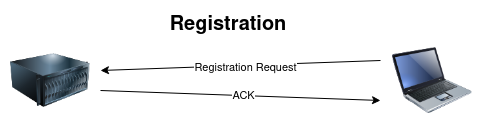
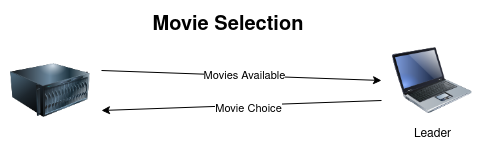
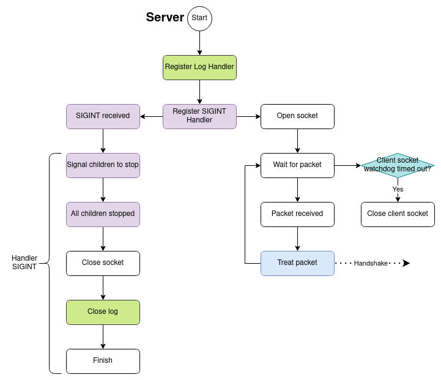

# Protocol
This protocol aims to describe a method to concurrently streaming different movies
to different groups of clients. To do so, it has two mais phases: the 
[handshake](#handshake) phase and the [streaming](#streaming) phase. In the handshake 
phase, it allocates a port between a leader client and the server. 
In the streaming phase, the clients wishing to join register to that session 
and the leader client chooses a available movie from the server to be streamed.
When the movie has finished being streamed, the session is closed.

## Handshake


The handshake process can be described as follows:
1. A leader client sends a request to a dedicated port of his choice
2. The server tries to allocated the requested port, in case it is being used,
   it allocates another one, and sends which port it has allocated for the
   client.
3. The client answer if it can or cannot use that port,
4. The server acknowledge the client answer.

The packets sent in each step are:
1. [Port Request](#port-request/port-allocated)
2. [Port Allocated](#port-request/port-allocated)
3. [Port OK/NOK](#port-ok/nok)
4. [Port ACK](#ack)

### Packets
#### Port Request/Port Allocated
```
0               1               2               3
0 1 2 3 4 5 6 7 8 1 2 3 4 5 6 7 8 1 2 3 4 5 6 7 8
+-+-+-+-+-+-+-+-+-+-+-+-+-+-+-+-+-+-+-+-+-+-+-+-+
|      Type     |      Seq      |      Port     |
+-+-+-+-+-+-+-+-+-+-+-+-+-+-+-+-+-+-+-+-+-+-+-+-+
``` 
#### Port OK/NOK
```
0               1               2               3
0 1 2 3 4 5 6 7 8 1 2 3 4 5 6 7 8 1 2 3 4 5 6 7 8 1
+-+-+-+-+-+-+-+-+-+-+-+-+-+-+-+-+-+-+-+-+-+-+-+-+-+
|      Type     |      Seq      |      Port     |F|
+-+-+-+-+-+-+-+-+-+-+-+-+-+-+-+-+-+-+-+-+-+-+-+-+-+
```

#### ACK
```
0               1               2 
0 1 2 3 4 5 6 7 8 1 2 3 4 5 6 7 8 
+-+-+-+-+-+-+-+-+-+-+-+-+-+-+-+-+
|      Type     |      Seq      |
+-+-+-+-+-+-+-+-+-+-+-+-+-+-+-+-+
```

#### Fields
| Field | Meaning |
|------ | ------- |
| [Type](#type) | Type of packet |
| [Seq(uence)](#seq) | The sequence number of the packet |
| [Port](#port) | Port that will be used to communicate |
| [F(lag)](#flag) | Flag to indicate whether the client could connect to the server or not |

##### Type
Each message has a type to indicate the operation type and each type is a power of
two. The flags and it's values are listed in the table below:

| Type | Packet |
| --- | ------ |
| 0x01 | [Port Request](#port-request/port-allocated) |
| 0x02 | [Port Allocated](#port-request/port-allocated) |
| 0x04 | [Port OK/NOK](#port-ok/nok) |
| 0x08 | [Port ACK](#ack) |

##### Sequence
The sequence field is a unsigned 64-bit number used to identify the packet in the *ACK* response.

##### Port
The port field is used to determine which port
will be used in communication by both the server and the client. After
succesfully binding to a commom port, the communication between the server and
the client will occur through it. The server will send it's packets throgh the
new port and expect new packets from the client to arrive though the new port. 
The client will close the socket to the standard port.

##### Flag
The flag field indicates whether the client could
bind to the same port as the server or not. A value of 1 indicates that the
connection was succesful and a value of 0 indicates that the client couldn't
bind.

## Streaming
### Registration


### Movie selection


### Movie stream

## Limitations
* The protocol doesn't define any protection against attacks to the server or to 
the client by overloading them with requests/responses.
* It also doesn't ensure that all members could connect to the server before
  starting to stream.
* After a stream has started, no other member can join, neither the stream can be
  paused.
* When a client loses connection to the server, the other clients in the group
  are not notified.
* The port is negotiated only with the leader, other clients in the same stream
  won't be able to watch it if they are using that port for something else,

# Implementation
## Modules
### Server


### Client


### Handshake
#### Server


#### Client


To avoid trying to connect indefinitly to the server, the client has a limit to
the number of attempts to try to establish the handshake.

### Stream
The interval between stream packets has a maximum and minimum thresholds.

### Sockets
### Watchdog
### Log
### Statistics

## Tests
## Project structure
Estrutura de arquivos:
```
/ 
|-----main.py 
|-----/tests
|-----/images
|-----/movies
|-----/server
|       |-----main.py
|       |-----parses.py
|       |-----handshake.py
|       |-----streaming.py
|       |-----registration.py
|
|-----/client
|       |-----main.py
|       |-----parses.py
|       |-----handshake.py
|       |-----streaming.py
|       |-----registration.py
|
|-----/utils
        |-----log.py
        |-----watchdog.py
        |-----statistics.py
```

